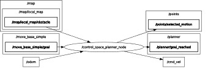

# Control Space Motion Planner Project

**Author**: Abu Hanif Muhammad Syarubany

## Overview
This project focuses on developing and evaluating motion planning techniques for a four-wheeled mecanum robot in a simulated ROS-Gazebo environment. The study explores both custom and open-source planners, including a control-space motion primitive planner and the TEB (Timed Elastic Band) local planner integrated with the `move_base` package. By combining global mapping, local obstacle detection, and dynamic path optimization, the experiments aim to achieve robust navigation and obstacle avoidance in both static and dynamic environments.

---

## 🛠 Dependencies
To run these simulations, you need to install the following dependencies:
* `sudo apt-get install ros-noetic-teb-local-planner`
* `sudo apt-get install ros-noetic-navigation`

---

## 🚀 Implementations and Results

### Problem 1: Global Occupancy Grid Map Generation
In this problem, a global occupancy grid map was built using a depth camera. 
* I made a new node, the occupancy grid mapper, which subscribes to the local costmap node such that I can make persistent mapping.
* I controlled the robot using a teleoperation node to move the robot such that the robot can explore the whole map. 
* Every area that has been explored is saved in the occupancy grid mapper node, such that the whole map can be generated after the robot finishing wandering around.
* The global occupancy grid map that has been generated is then used on the later problem, especially problem 3 and problem 4 as the global cost map.

*(Click the image to watch the P1 Simulation on YouTube)*

### Problem 2: Motion Primitives Planner
Through this experiment, I developed motion planning using motion primitives. 
* The graph planner will send navigation goal one by one with a certain timing out duration to the robot such that robot can approach the navigation goal. 
* As shown in the simulation video, the robot can finish the whole track given by the graph planner.
* But, there are two collisions happened because the robot could not have an aggressive steering delta if the obstacle was just too close in front of the robot.
* The challenges throughout this experiment is this problem requires a lot of parameter tuning, such as weight and reward parameter in the cost term calculation.

*(Click the image to watch the P2 Simulation on YouTube)*

### Problem 3: TEB Planner in Static Environment
Through this experiment, I tried to use other motion planning using opensource local planner, specifically TEB (Timed Elastic Band) planner.
* In this experiment, the robot successfully finished the trajectory path given by the graph planner without any collision.
* In the problem 3, the local cost map is derived from the depth camera.
* The challenges throughout the experiment is to tune the TEB parameters such that it can avoid obstacles while doing the task.

*(Click the image to watch the P3 Simulation on YouTube)*

### Problem 4: TEB Planner in Dynamic Environment
Through this experiment, I used the same planner as the previous problem.
* Instead of having a local cost map layer derived by the depth camera, I used the 2d-lidar scan to have an obstacle layer (voxel layer) with a lethal value such that this layer can track dynamic movement from the moving object with lethal cost and inflation cost value.
* The challenges here are I need to tune many parameters, calculate many tolerance parameters (TF, planner, and controller), as well as the frequency on each layer.
* However, most of the time, the robot can accomplish the goal following the whole trajectory without any collision with the probability of 60%, which means that 6 out of 10 simulations that I tried are successful. 
* Throughout the task, the robot sometimes got hit by the moving obstacles such that it ruins the odometry sensors. If that case happened, the robot will be confused and can not continue following the trajectory path.

*(Click the image to watch the P4 Simulation on YouTube)*

---

## ⚙️ Planner Design Details

### 1. Motion Primitives Architecture

In motion primitive based planner, the control space planner node is using local map obstacle derived from the depth camera cost map. It can publish `/points/selected_motion` and `cmd_vel` to directly control the robot movement in reaching the navigation goal. 

The key methodology to derive motion primitives based planner is cost term calculation. Below is the total cost calculation:
$cost\_total=W\_GOAL \cdot J\_goal+W\_HEAD \cdot J\_head+W\_STEER \cdot J\_st+W\_TRAV \cdot J\_trav-W\_PROG \cdot progress\_\pi$

In addition to that cost, there is a reward term if the robot takes an early turning due to a sudden potential collision:
$cost\_total - W\_EARLY\_TURN \cdot J\_early\_turn$
